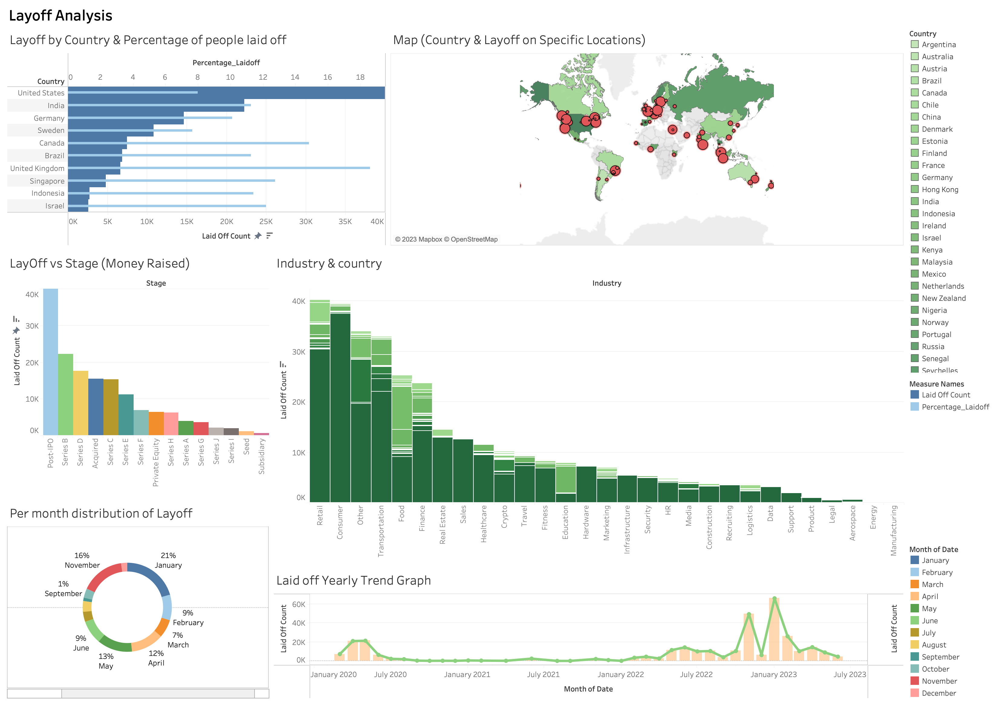

# Layoff Data - Exploratory Data Analysis (EDA)

This repository contains the findings from an Exploratory Data Analysis (EDA) conducted on a layoff dataset. The dataset provides insights into layoffs across different industries, company stages, time periods, and countries. The analysis aims to uncover patterns, trends, and key observations related to layoffs.

## Dashboard Preview

## Key Observations

1. **Month-wise Layoffs**:
   The analysis reveals that January consistently experiences the highest number of layoffs throughout the year. This trend could be attributed to the fact that many companies undertake restructures, reorganizations, and planning for the new year during this time, leading to both layoffs and new recruitment activities.

2. **Industry Impact**:
   The retail industry emerges as the sector with the highest number of layoffs, followed by the consumer and transportation industries. This observation could be indicative of certain seasonal trends or market dynamics that influence these sectors.

3. **Company Stage Analysis**:
   The majority of the companies with layoffs are in the post-IPO stage. This finding suggests that companies that have recently gone public might undergo certain adjustments or realignments that lead to workforce reductions.

4. **Temporal Trends**:
   A notable temporal trend is observed for January 2023, which experienced six times more layoffs compared to January 2020. Moreover, over the period from January 2020 to July 2023, January consistently stands out as the month with the highest number of layoffs, accounting for as much as 21% of the total layoffs.

5. **Country-wise Analysis**:
   The United States emerges as the country with the highest number of laid-off individuals, surpassing other nations. India follows as the second-highest country in terms of layoffs. Additionally, the United Kingdom stands out with the highest percentage of laid-off individuals, highlighting a substantial impact within that region.

## Repository Contents

- `airtable.csv`: The dataset used for the analysis.
- `analysis.ipynb`: Jupyter Notebook containing the code and step-by-step EDA process.
- `README.md`: This document summarizes the observations and insights from the EDA.
- `Layoff Analysis Dashboard packaged.twbx`: This document is a Interactive Tableau Visulization graphs and Dashboard.

## Usage

1. Clone this repository to your local machine `git clone https://github.com/jashpaleja/EDA-on-Layoff-Dataset.git`.
2. Open the Jupyter Notebook `analysis.ipynb` to review the code and analysis.
3. The notebook contains explanations, and interpretations of the data.
4. The Tableau file '.twbx' contains all the visualization needed to complete the analysis.
5. Modify the code and analysis as needed for your own insights.

## Conclusion

The EDA provides valuable insights into layoff trends based on various dimensions such as month, industry, company stage, time period, and country. These observations can serve as a foundation for further research, strategy development, or decision-making related to workforce management and organizational planning.
